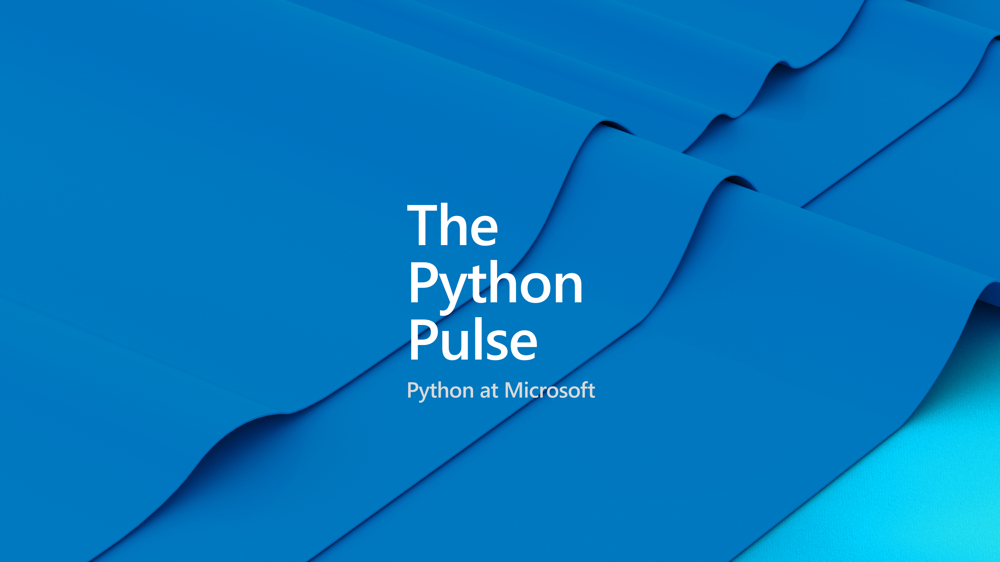

[< Back to stream](https://aka.ms/python-pulse-live)

# Stream Notes
- [Playwright Python Docs](https://playwright.dev/python/docs/intro)
- [Playwright Python GitHub repo](https://github.com/microsoft/playwright-python)
- [Submit a issue for Python support in VS Code](https://aka.ms/pvsc-bug)
- [Python in Visual Studio Code - August 2023 Release](https://devblogs.microsoft.com/python/python-in-visual-studio-code-august-2023-release/)
- [VS Code - August 2023 Release](https://code.visualstudio.com/updates/v1_71)
- [Playwright Discord](https://discord.com/invite/playwright-807756831384403968)

**...more stream notes**
- [Automation Panda - Playwright Python Tutorial](https://github.com/AutomationPanda/playwright-python-tutorial)
- [Automation Panda - Playwright at PyCon US ](https://www.youtube.com/watch?v=5Wykd5OWSDQ)
- [Playwright Python Announcement](https://devblogs.microsoft.com/python/announcing-playwright-for-python-reliable-end-to-end-testing-for-the-web/)
- [Playwright Youtube](https://www.youtube.com/@Playwrightdev)

# Announcements
- Polyglot notebook now supports Python and R [learn more >>](https://code.visualstudio.com/docs/languages/polyglot)
- PyDay and VS Code Day on-demand videos [watch PyDay >>](https://www.youtube.com/live/WPVm-DXhGGM?feature=share) [watch VS Code Day playlist >>](https://www.youtube.com/playlist?list=PLj6YeMhvp2S7hWnmPEcxsSPEB0FLHqi0j)
- Python VS Code Templates [learn more >>](https://code.visualstudio.com/api/advanced-topics/python-extension-template)
- Azure App Service now supports Python 3.11
- More azd templates [learn more >>](https://azure.github.io/awesome-azd/?tags=python)
- Azure Developer CLI (azd) – announced 1.0 ! [learn more>>](https://devblogs.microsoft.com/azure-sdk/azure-developer-cli-azd-february-2023-release/)
- Azure Python SDK [learn more >>](https://github.com/Azure/azure-sdk-for-python/releases?page=2)

| | |
|----|----|
| Topic / Episode Name | E2E Testing with Playwright |
| Description |Join cloud advocates Pamela Fox and Sarah Kaiser to learn about end-to-end-testing with Playwright, an open source browser automation library. We'll test Python web apps using the pytest framework, show how to generate tests visually, and discuss accessibility testing too.|
| Tags | Join cloud advocates Pamela Fox and Sarah Kaiser to learn about end-to-end-testing with Playwright, an open source browser automation library. We'll test Python web apps using the pytest framework, show how to generate tests visually, and discuss accessibility testing too. |

---
# Connect

Sarah Kaiser | Mastodon: [@crazy4pi314](crazy4pi314@mathstodon.xyz)

PamelaFox | Mastodon: [@pamelafox](https://fosstodon.org/@pamelafox)

Python VS Code | Twitter: [@PythonVSCode](https://twitter.com/PythonVSCode)

Python @ Microsoft | Discord: [https://aka.ms/python-discord](https://aka.ms/python-discord)
