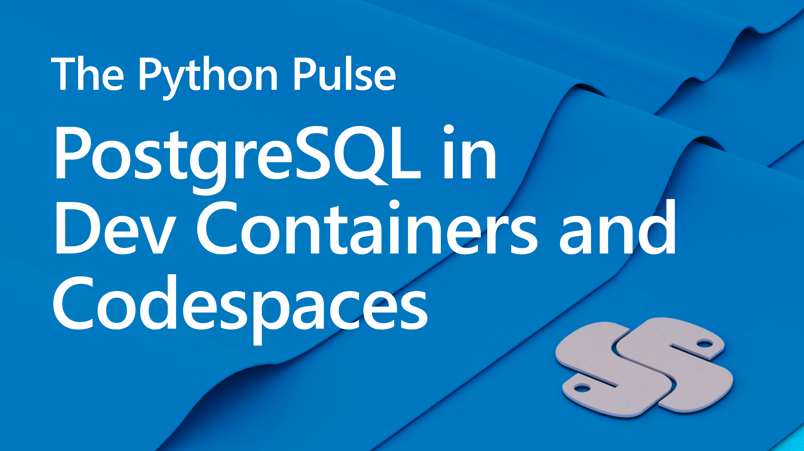

# Stream Notes

- [GitHub Dev Containers Community](https://github.com/devcontainers)
- [GitHub Codespaces Overview](https://docs.github.com/en/codespaces/overview)
- [PostgreSQL VS Code Extension](https://marketplace.visualstudio.com/items?itemName=ms-ossdata.vscode-postgresql)
- [SQLTools Extension](https://marketplace.visualstudio.com/items?itemName=mtxr.sqltools)

- [Development Containers](https://containers.dev/)
- [VS Code tutorial: Create Dev Container](https://code.visualstudio.com/docs/devcontainers/create-dev-container)
- [Blog post: Running PostgreSQL in a Dev Container with Flask/Django](http://blog.pamelafox.org/2022/11/running-postgresql-in-devcontainer-with.html)
- [Video: Running a Flask+PostgreSQL server in Codespaces](https://www.youtube.com/watch?v=vEtR5qsXfZE)
- [Django restaurant review app with Dev Container: github.com/Azure-samples/msdocs-django-postgresql-sample-app-azd](https://github.com/Azure-samples/msdocs-django-postgresql-sample-app-azd)
- [Flask restaurant review app with Dev Container: github.com/Azure-samples/msdocs-flask-postgresql-sample-app-azd](https://github.com/Azure-samples/msdocs-flask-postgresql-sample-app-azd)
- [Flask quiz app with Dev Container: github.com/pamelafox/flask-db-quiz-example](https://github.com/pamelafox/flask-db-quiz-example)
-[Django quiz app with Dev Container: github.com/pamelafox/django-quiz-app](https://github.com/pamelafox/django-quiz-app)

---

**Connect**

Dawn Wages | Twitter: [@BajoranEngineer](https://twitter.com/BajoranEngineer)

Pamela Fox | Twitter: [@PamelaFox](https://twitter.com/pamelafox)

Python VS Code | Twitter: [@AzureFriday](https://twitter.com/PythonVSCode)

Python @ Microsoft | Discord: https://aka.ms/python-discord
