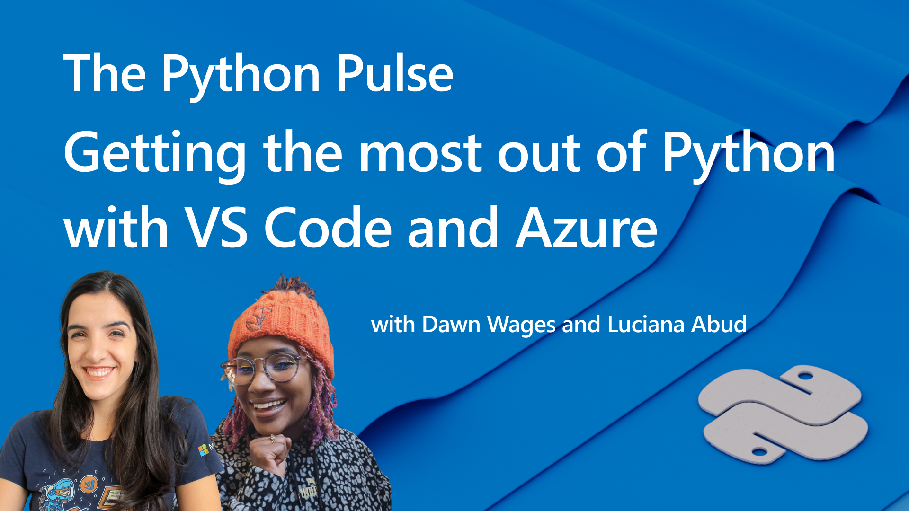

[< Back to stream](https://aka.ms/python-pulse-live)

# Stream Notes
- [Submit a issue for Python support in VS Code](https://aka.ms/pvsc-bug)
- [Python in Visual Studio Code - February 2023 Release](https://devblogs.microsoft.com/python/python-in-visual-studio-code-february-2023-release/)
- [VS Code Releases](https://code.visualstudio.com/updates/v1_75)
- [VS Code Python Tutorial](https://code.visualstudio.com/docs/python/python-tutorial)
- [VS Code Django Tutorial](https://code.visualstudio.com/docs/python/tutorial-django)
- [VS Code Pyton Tutorial](https://code.visualstudio.com/docs/python/tutorial-flask)
- [Deploy Python Apps through VS Code](https://code.visualstudio.com/docs/python/python-on-azure)
- [VS Code Python Settings Reference](https://code.visualstudio.com/docs/python/settings-reference)
- [Get started with Python in Visual Stuido Code Learn Module](https://learn.microsoft.com/en-us/training/modules/python-install-vscode/)

# Announcements
- Azure Developer CLI (azd) – February 2023 Release [learn more>>](https://devblogs.microsoft.com/azure-sdk/azure-developer-cli-azd-february-2023-release/)
- 1-click deploys of Python web apps to Azure @ Python Web Conference
- Designing effective load tests for your web application @ Python Web Conference
- Python VS Code Templates [learn more >>](https://code.visualstudio.com/api/advanced-topics/python-extension-template)
- Azure App Service now supports Python 3.11
- More azd templates [learn more >>](https://azure.github.io/awesome-azd/?tags=python)

---

| | |
|----|----|
| Topic / Episode Name | The Python Pulse - Getting the Most out of Python with VS Code and Azure |
| Description | We do some quick tips and resources on getting the most out of Python with VS Code and Azure. |
| Social Text | 🔴📹 The Python Pulse is LIVE *this* Friday, April 11 11AM PT / 7PM UTC ! Join [@BajoranEngineer](twitter.com/BajoranEngineer) and [@luumelo14](twitter.com/luumelo14) discuss tips, tools and resources for getting the most out of your Python experience in VS Code and Azure and a sneak peek for PyCon 2023.  |
| Tags | #python #vscode |

---
# Connect

Dawn Wages | Twitter: [@BajoranEngineer](https://twitter.com/BajoranEngineer)

Luciana Abud | Twitter: [@luumelo14](https://twitter.com/luumelo14)

Python VS Code | Twitter: [@PythonVSCode](https://twitter.com/PythonVSCode)

Python @ Microsoft | Discord: [https://aka.ms/python-discord](https://aka.ms/python-discord)
