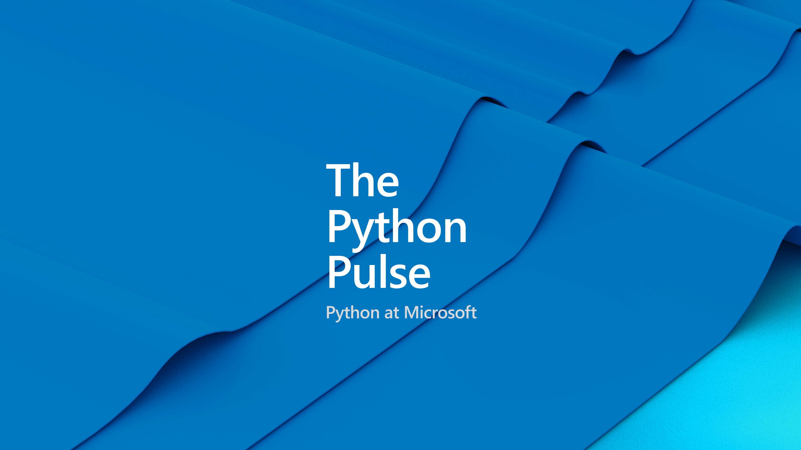

[< Back to stream](https://aka.ms/python-pulse-live)

# Stream Notes
- [VS Code Insiders - Python + GitHub Profile](https://insiders.vscode.dev/profile/github/0b09e809a2199de2e5c62071f42a16e8)
- [VS Code - Python + GitHub Profile](https://vscode.dev/profile/github/0b09e809a2199de2e5c62071f42a16e8)
- [GitHub and VS Code 101](https://vscode.github.com/)
- [Working with GitHub in VS Code](https://code.visualstudio.com/docs/sourcecontrol/github)
- [What is the GitHub Copilot Extension for Visual Studio Code?](https://learn.microsoft.com/en-us/visualstudio/ide/visual-studio-github-copilot-extension)
- [Using GitHub Codespaces in Visual Studio Code](https://docs.github.com/en/codespaces/developing-in-codespaces/using-github-codespaces-in-visual-studio-code)
- [Submit a issue for Python support in VS Code](https://aka.ms/pvsc-bug)
- [Python in Visual Studio Code - July 2023 Release](https://devblogs.microsoft.com/python/python-in-visual-studio-code-july-2023-release/)
- [VS Code - July 2023 Release](https://code.visualstudio.com/updates/v1_81)

**...more stream notes**

- [VS Code Python Tutorial](https://code.visualstudio.com/docs/python/python-tutorial)
- [VS Code Django Tutorial](https://code.visualstudio.com/docs/python/tutorial-django)
- [VS Code Python Tutorial](https://code.visualstudio.com/docs/python/tutorial-flask)
- [Deploy Python Apps through VS Code](https://code.visualstudio.com/docs/python/python-on-azure)
- [VS Code Python Settings Reference](https://code.visualstudio.com/docs/python/settings-reference)
- [Get started with Python in Visual Stuido Code Learn Module](https://learn.microsoft.com/en-us/training/modules/python-install-vscode/)

# Announcements
- Polyglot notebook now supports Python and R [learn more >>](https://code.visualstudio.com/docs/languages/polyglot)
- PyDay and VS Code Day on-demand videos [watch PyDay >>](https://www.youtube.com/live/WPVm-DXhGGM?feature=share) [watch VS Code Day playlist >>](https://www.youtube.com/playlist?list=PLj6YeMhvp2S7hWnmPEcxsSPEB0FLHqi0j)
- Python VS Code Templates [learn more >>](https://code.visualstudio.com/api/advanced-topics/python-extension-template)
- Azure App Service now supports Python 3.11
- More azd templates [learn more >>](https://azure.github.io/awesome-azd/?tags=python)
- Azure Developer CLI (azd) – announced 1.0 ! [learn more>>](https://devblogs.microsoft.com/azure-sdk/azure-developer-cli-azd-february-2023-release/)
- Azure Python SDK [learn more >>](https://github.com/Azure/azure-sdk-for-python/releases?page=2)

| | |
|----|----|
| Topic / Episode Name | The Python Pulse - GitHub Extensions |
| Description | We will look at how to keep focus on our code while working with GitHub by utilizing their extensions in VS Code. We can get help from copilot, we choose our issues and manage PRs, and we check our deployment statuses, all while not leaving our editor. |
| Social Text | We're jumping into GitHub extensions in another episode of The Python Pulse Friday, July 11th 11am PST / 2pm EST / 7pm BST. Save the date 📅 so you can join us live 🔴📹 with [@kjaymiller](twitter.com/kjaymiller) copilot, PRs and deploying with GitHub and VS Code. |
| Tags | #python #vscode |

---
# Connect

Dawn Wages | Twitter: [@BajoranEngineer](https://twitter.com/BajoranEngineer)

Luciana Abud | Twitter: [@kjaymiller](https://twitter.com/kjaymiller)

Python VS Code | Twitter: [@PythonVSCode](https://twitter.com/PythonVSCode)

Python @ Microsoft | Discord: [https://aka.ms/python-discord](https://aka.ms/python-discord)
