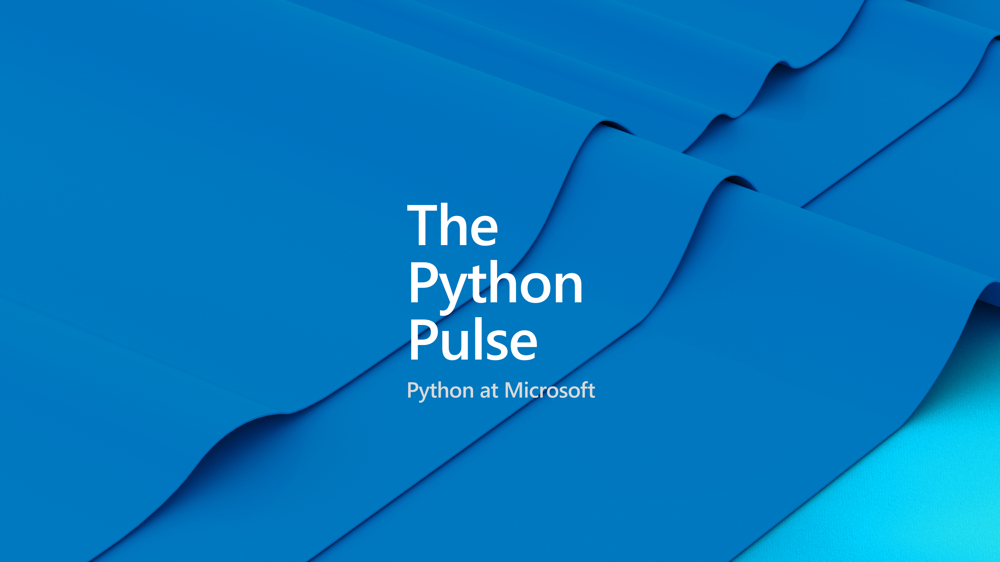

# Stream Notes
- [VS Code Profile - Data Wrangler](https://aka.ms/006-data-wrangler-profile)
- [Working with Jupyter Notebooks in VS Code](https://code.visualstudio.com/docs/datascience/jupyter-notebooks)
- [Data Science in VS Code Tutorial](https://code.visualstudio.com/docs/datascience/data-science-tutorial)
- [Get started with Jupyter notebooks for Python - Learn Module](https://learn.microsoft.com/en-us/training/modules/python-create-run-jupyter-notebook/)
- [Beginner Python - Learn Module](https://learn.microsoft.com/en-us/training/paths/beginner-python/)
- [Track model triaining in Jupyter notebooks with MLflow - Learn Module](https://learn.microsoft.com/en-us/training/modules/track-model-training-jupyter-notebooks-mlflow/)

# Announcements
- Python Functions 3.10 support is generally available [learn more >>](https://azure.microsoft.com/en-au/products/functions/) 
- Azure Developer CLI (azd) – February 2023 Release [learn more>>](https://devblogs.microsoft.com/azure-sdk/azure-developer-cli-azd-february-2023-release/)
- Python VS Code Templates [learn more >>](https://code.visualstudio.com/api/advanced-topics/python-extension-template)
- Azure App Service now supports Python 3.11
- More azd templates [learn more >>](https://azure.github.io/awesome-azd/?tags=python)
- PyCon blog post coming soon
- Build 2023
- Python Software Foundation Board of Directors Elections 

---

| | |
|----|----|
| Introduction / Bio | Jason Mew  |
| Topic / Episode Name | Revolutionizing the way you clean data with Data Wrangler |
| Description | Explore the new Data Wrangler VS Code extension with us! A new tool for data scientists and analysts who work with tabular data in Python.  |
| Social Text | The Python Pulse live stream will cover how the new Data Wrangler extension for @code / VS Code brings the power of the go-to tool for #datascience into your code editor with Dawn Wages and guest Jason Mew. Mark your calendars 📅 Friday, May 12th 11AM PT / 7PM UTC |
| Tags | #python #datascience #jupyter #datawrangler #computation |

---
# Connect

Dawn Wages | Twitter: [@BajoranEngineer](https://twitter.com/BajoranEngineer)

Python VS Code | Twitter: [@PythonVSCode](https://twitter.com/PythonVSCode)

Python @ Microsoft | Discord: [https://aka.ms/python-discord](https://aka.ms/python-discord)

