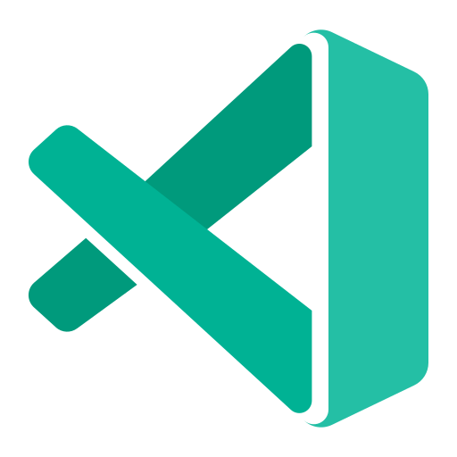
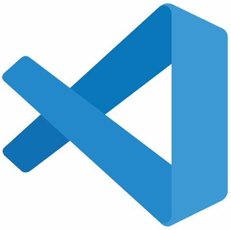

[< Back to stream](https://aka.ms/python-pulse-live)

# Stream Notes
|VS Code - Insiders Profile| VS Code - Monthly Release Profile |
|---|---|
|  | |

- [Python Web Apps Day Livestream - June 6th 2024](https://aka.ms/python-web-apps-2024)
- [Quickstart: Deploy a Python (Django or Flask) web app to Azure App Service - Documentation](https://learn.microsoft.com/en-us/azure/app-service/quickstart-python?tabs=flask%2Cwindows%2Cazure-cli%2Cazure-cli-deploy%2Cdeploy-instructions-azportal%2Cterminal-bash%2Cdeploy-instructions-zip-azcli)
- [VS Code Django Tutorial - Documentation](https://code.visualstudio.com/docs/python/tutorial-django)
- [VS Code Flask Tutorial - Documentation](https://code.visualstudio.com/docs/python/tutorial-flask)
- [Azure Database for PostgreSQL - Landing Page](https://azure.microsoft.com/en-us/products/postgresql)
- [Azure Database for PostgreSQL - Documentation](https://learn.microsoft.com/en-us/azure/postgresql/)
- [FastAPI with Azure Functions - Documentation](https://learn.microsoft.com/en-us/samples/azure-samples/fastapi-on-azure-functions/fastapi-on-azure-functions/)
- [FastAPI on Azure Functions - Sample Repo](https://github.com/Azure-Samples/fastapi-on-azure-functions)
- [VS Code FastAPI Tutorial - Documentation](https://code.visualstudio.com/docs/python/tutorial-fastapi)
- [Connect to and query Azure SQL Database using Python and the pyodbc driver - Documentation](https://learn.microsoft.com/en-us/azure/azure-sql/database/azure-sql-python-quickstart?view=azuresql&tabs=windows%2Csql-inter)
- [Get started with Azure CosmosDB for NoSQL using Python](https://learn.microsoft.com/en-us/azure/cosmos-db/nosql/how-to-python-get-started?tabs=env-virtual%2Cazure-cli%2Cwindows)
- [Python in Visual Studio Code - May 2024 v1.89 Release](https://devblogs.microsoft.com/python/python-in-visual-studio-code-may-2024-release/)
- [VS Code - v1.89 Release](https://code.visualstudio.com/updates/v1_89)

**...more stream notes**

- [Deploy Python Apps through VS Code](https://code.visualstudio.com/docs/python/python-on-azure)
- [VS Code Python Settings Reference](https://code.visualstudio.com/docs/python/settings-reference)
- [Get started with Python in Visual Stuido Code Learn Module](https://learn.microsoft.com/en-us/training/modules/python-install-vscode/)

----

| | |
|----|----|
| Topic / Episode Name | 🔴 Most popular Python web frameworks |
| Description | Join Pamela Fox and Dawn Wages as they chat all things Python on the Web with the most popular frameworks: Flask, Django and FastAPI in preparation for Python Web Apps Day June 6th, 2024 |
| Social Text | 🐍 Join @PamelaFox and @BajoranEngineer on Friday, May 10th at 11am PST for another Python Pulse live! In preparation for Python Web App Day, we're diving into Flask, FastAPI, and Django. All in under 60 minutes ⏲️ #WebDevelopment #python |
| Tags | #fastapi #python #opensource #django #data #github #vscode #flask |

---
# Connect

Dawn Wages | Twitter: [@BajoranEngineer](https://twitter.com/BajoranEngineer)

Pamela Fox | Twitter: [@PamelaFox](https://twitter.com/PamelaFox)

Python VS Code | Twitter: [@PythonVSCode](https://twitter.com/PythonVSCode)

Python @ Microsoft | Discord: [https://aka.ms/python-discord](https://aka.ms/python-discord)

