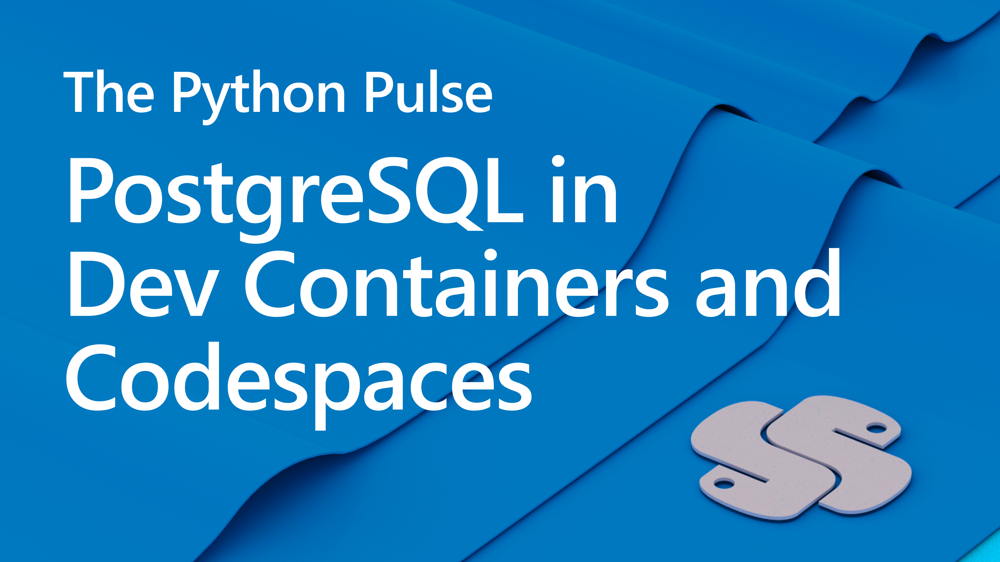

# Stream Notes
- [GitHub Dev Containers Community](https://github.com/devcontainers)
- [GitHub Codespaces Overview](https://docs.github.com/en/codespaces/overview)
- [PostgreSQL VS Code Extension](https://marketplace.visualstudio.com/items?itemName=ms-ossdata.vscode-postgresql)
- [SQLTools Extension](https://marketplace.visualstudio.com/items?itemName=mtxr.sqltools)
- [Development Containers](https://containers.dev/)
- [VS Code tutorial: Create Dev Container](https://code.visualstudio.com/docs/devcontainers/create-dev-container)
- [Blog post: Running PostgreSQL in a Dev Container with Flask/Django](http://blog.pamelafox.org/2022/11/running-postgresql-in-devcontainer-with.html)
- [Video: Running a Flask+PostgreSQL server in Codespaces](https://www.youtube.com/watch?v=vEtR5qsXfZE)
- [Django restaurant review app with Dev Container: github.com/Azure-samples/msdocs-django-postgresql-sample-app-azd](https://github.com/Azure-samples/msdocs-django-postgresql-sample-app-azd)
- [Flask restaurant review app with Dev Container: github.com/Azure-samples/msdocs-flask-postgresql-sample-app-azd](https://github.com/Azure-samples/msdocs-flask-postgresql-sample-app-azd)
- [Flask quiz app with Dev Container: github.com/pamelafox/flask-db-quiz-example](https://github.com/pamelafox/flask-db-quiz-example)
-[Django quiz app with Dev Container: github.com/pamelafox/django-quiz-app](https://github.com/pamelafox/django-quiz-app)

# Announcements
- Celebrating 10 years of Azure App Service’s free tier [learn more >>](https://techcommunity.microsoft.com/t5/apps-on-azure-blog/celebrating-10-years-of-azure-app-service-s-free-tier/ba-p/3621148)
- Python VS Code Templates [learn more >>](https://code.visualstudio.com/api/advanced-topics/python-extension-template)
- Azure App Service supports Python 3.11
- Azure Functions Python 3.10 preview
- More azd templates [learn more >>](https://azure.github.io/awesome-azd/?tags=python)

---

| | |
|----|----|
| Introduction / Bio | Pamela Fox (she/her) is a Cloud Developer Advocate that has been in the tech industry for 15 years. She has taught Computer Science at UC Berkeley, volunteered in bay area classroom, ogranized in her community, drove features as an engineer and content for Coursera and Khan Academy.  |
| Topic / Episode Name | The Python Pulse - Dev Containers, Codespaces working seamlessly with your Postgres DB |
| Description | Dev Containers and Codespaces  allow you to open and clone in a local or cloud-hosted dev container. You're now able to take advantage of the VS Code full development features -- including support for the SQLTools extension and Postgres Extension in Codespaces (devcontainers) where you can make decisions for and query your database with Postgres or SQLTools extensions. |
| Social Text | Dawn Wages will chat with [Pamela Fox](https://github.com/pamelafox) Microsoft Cloud Advocate about Dev Containers, Codespaces and VS Code extensions available to make action and query your databases.  |
| Tags | #python #codespaces #azure #postgres #SQL #devcontainers |

---
**Connect**

Dawn Wages | Twitter: [@BajoranEngineer](https://twitter.com/BajoranEngineer)

Pamela Fox | Twitter: [@PamelaFox](https://twitter.com/pamelafox)

Python VS Code | Twitter: [@AzureFriday](https://twitter.com/PythonVSCode)

Python @ Microsoft | Discord: https://aka.ms/python-discord
